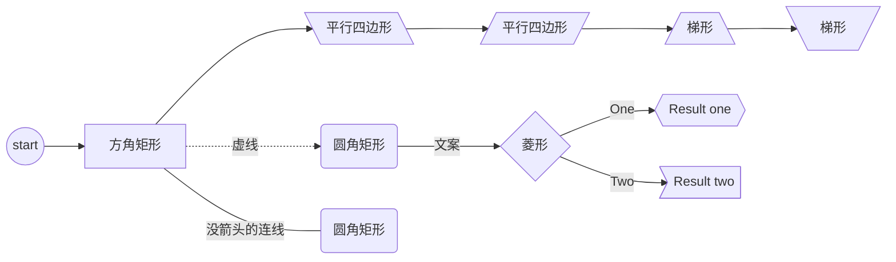
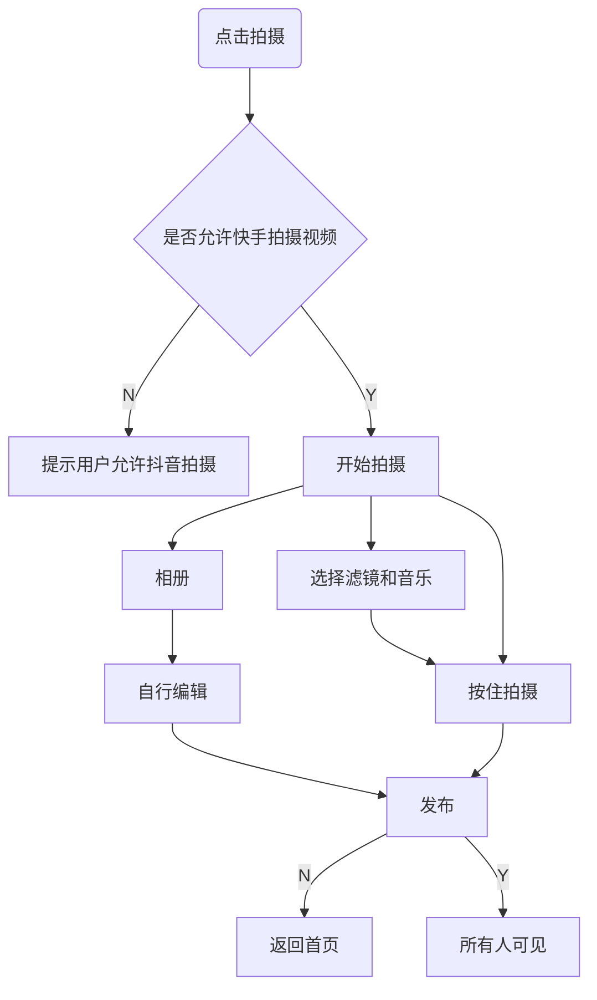
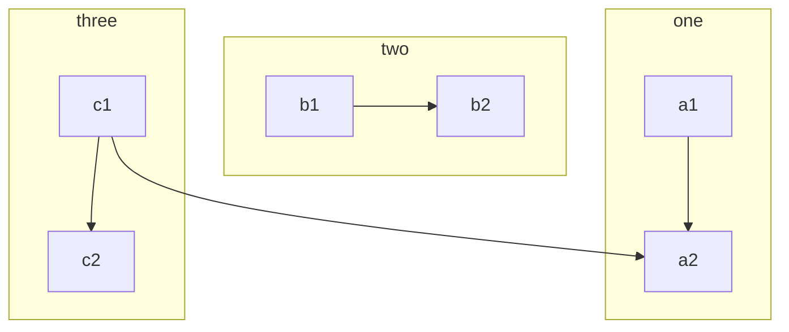
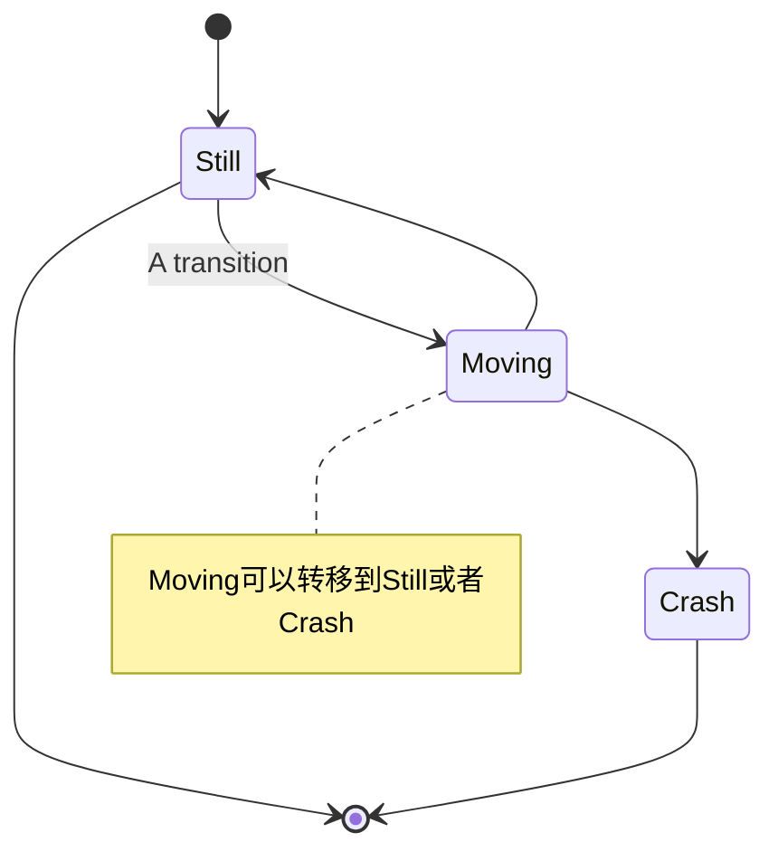
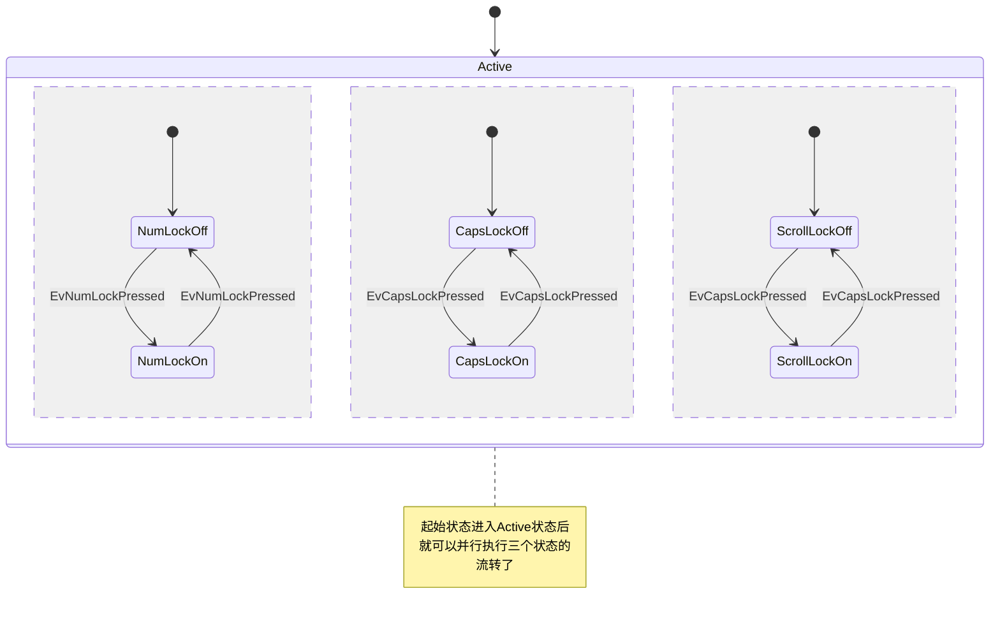
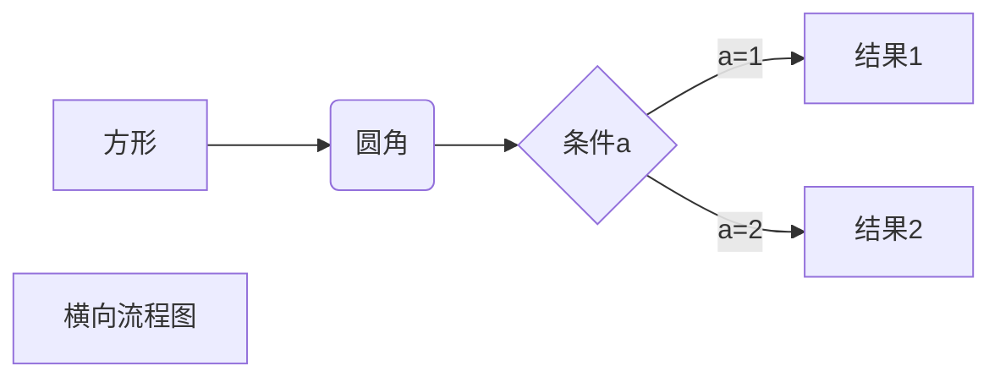
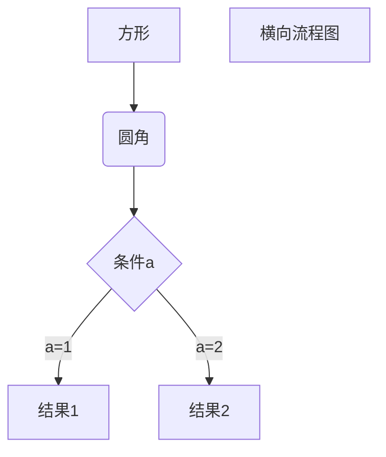

<font face="黑体">我是黑体字</font>
<font face="微软雅黑">我是微软雅黑</font>
<font face="STCAIYUN">我是华文彩云</font>
<font color=red>我是红色</font>
<font color=#008000>我是绿色</font>
<font color=Blue>我是蓝色</font>
<font size=5>我是尺寸</font>
<font face="黑体" color=green size=5>我是黑体，绿色，尺寸为5</font>
$$
Y = \begin{cases}1\quad \text {if \textcolor{orange}{stoke}}  \\
2\quad \text{if \textcolor{orange}{drug overdose};}\\
3 \quad\text{if \textcolor{orange}{drug epileptic seizure}}
\end{cases}
$$


$$
y=\begin{cases}1\quad\text{第一个内容}\\
2\quad\text{第二个内容}\\3\quad\text{第三个内容}\end{cases}
$$

*这里是文字*
_这里是文字_
**这里是文字**
***这里是文字***
~~这里是文字~~


> 引用1

> > 引用2

> > > 引用3


<table><tr><td bgcolor=orange>背景色是：orange</td></tr></table>

<table><tr><td bgcolor=red>背景色是红色：</td></tr></table>






```flow
st=>start: 开始
op=>operation: my operation
cond=>condition: yes or No?
e=>end: 结束

st->op->cond
cond(yes)->e
cond(no)->op

```


```flow
st=>start: 开始框
 
op=>operation: 处理框
 
cond=>condition: 判断框(是或否?)
 
sub1=>subroutine: 子流程
 
io=>inputoutput: 输入输出框
 
e=>end: 结束框
 
st->op->cond
 
cond(yes)->io->e
 
cond(no)->sub1(right)->op
```















